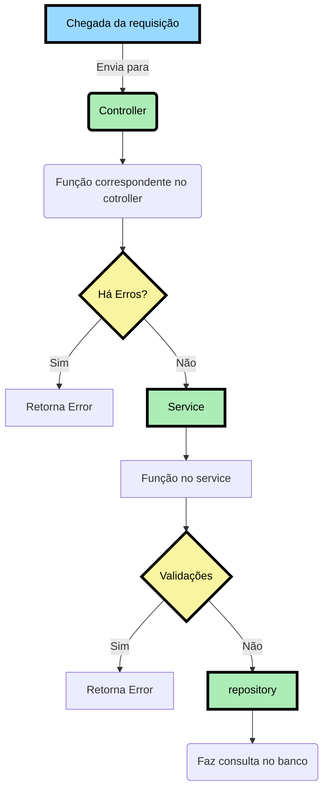
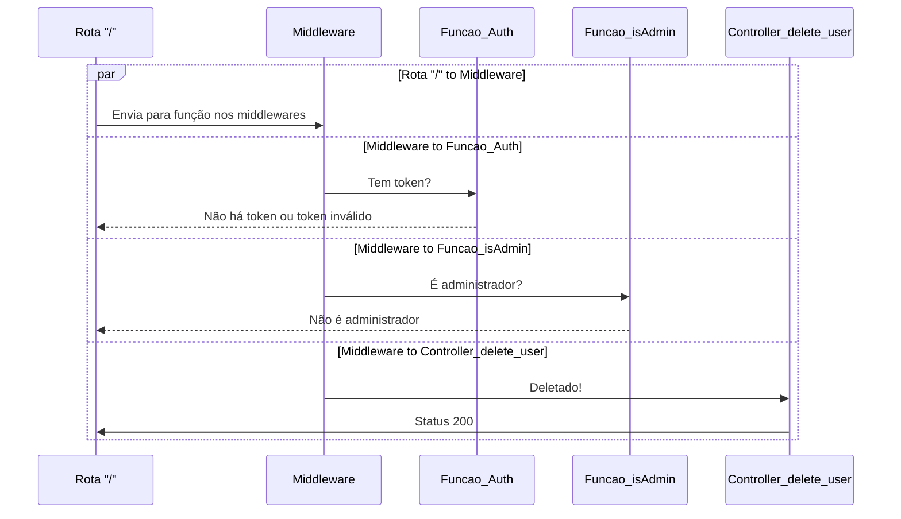

# SUPERMERCADO SQ - BACKEND / DATABASE

## Documentação 

Link para a documentação da API: https://apisupersq.supermercadosq.com.br/documentation/redoc

## Configurando e inicializando o projeto

Primeiramente deverá fazer o clone da aplicação em sua máquina:

Através do https
```
    git clone https://github.com/stack-over-code-atlantico/supermercadosq-be.git
```

Através do ssh
```
    git clone git@github.com:stack-over-code-atlantico/supermercadosq-be.git
```

Utilizamos o `npm install` para instalar todas as depedências utilizadas no projeto.

```
    npm install 
```
Para essa próxima etapa é necessário ter o arquivo `.env` configurado

Logo após a instalação, utilizamos o `npx prisma generate` para inicilizar e gerar um cliente prisma. 
```
    npx prisma generate
```

E, por fim, usamos o `npm run dev` para iniciar o servidor em modo de desenvolvimento utilizando a biblioteca `nodemon` no endereço: [http://localhost:3000](http://localhost:3000)
```
    npm run dev
```

## Dependências

<ul>
    <li>
        <a href="https://www.prisma.io/docs/concepts/components/prisma-client">
            @prisma/client
        </a>
    </li>
    <li>
        <a href="https://www.npmjs.com/package/bcrypt">
            bcrypt
        </a>
    </li>
    <li>
        <a href="https://expressjs.com/pt-br/">
            express
        </a>
    </li>
    <li>
        <a href="https://www.npmjs.com/package/express-async-errors">
            express-async-errors
        </a>
    </li>
    <li>
        <a href="https://jwt.io/introduction">
            jsonwebtoken
        </a>
    </li>
    <li>
        <a href="https://www.npmjs.com/package/module-alias">
            module-alias
        </a>
    </li>
    <li>
        <a href="https://www.npmjs.com/package/uuid">
            uuid
        </a>
    </li>
</ul>

## Depedências de desenvolvimento
<ul>
    <li>
        <a href="https://www.npmjs.com/package/nodemon">
            nodemon
        </a>
    </li>
    <li>
        <a href="https://www.prisma.io/">
            prisma
        </a>
    </li>
</ul>

## Arquitetura de Pastas do Backend


## Fluxo da Aplicação


## Fluxo para **Deletar usuário**



## Endpoints / Rotas

** Todas as informações nos endpoints entre parenteses "()" são os valores ou parâmetros

** Todas as informações nas requisições adicionadas do ícone "👨‍⚖️" são rotas que exigem autenticação(token) de administrador.

** Todas as informações nas requisições adicionadas do ícone "👤" são rotas que exigem autenticação(token) de usuário.

<h3>
    Login
</h3>

| Ação           | Requisição | Rota      |
|----------------|------------|-----------|
| Fazer o login  | `POST`     | /login    |

<h3>
    Usuários
</h3>

| Ação                                                                                                         | Requisição | Rota                         | 
|--------------------------------------------------------------------------------------------------------------|------------|------------------------------|
| Listar todos os usuários                                                                                     | `GET`      | /users                       | 
| Criar um novo usuário                                                                                        | `POST`     | /users                       |
| Atualizar as informações de um usuário                                                                       | `PUT` 👤   | /users/(cpf_cnpj)            |
| Deletar o usuário (setar o valor do atributo "ativo": false)                                                 | `PUT` 👨‍⚖️   | /users/(cpf_cnpj)/delete     |
| Alterar o nível de usuário (setar o valor do atributo "nivel": "ADMINISTRADOR" ou "CLIENTE" ou "FORNECEDOR") | `PUT` 👨‍⚖️   | /users/(cpf_cnpj)/nivel_edit |

<h3>
    Produtos
</h3>

| Ação                                                                                 | Requisição | Rota                                   |
|--------------------------------------------------------------------------------------|------------|----------------------------------------|
| Listar todos os produtos                                                             | `GET`      | /products                              |
| Criar uma postagem de um produto                                                     | `POST` 👤  | /products                              |
| Alterar a postagem do produto cadastrado                                             | `PUT` 👤   | /products/(id_produto)                 |
| Deletar uma postagem de um produto (setar o valor do atributo "status": "REPROVADO") | `PUT` 👤   | /products/(id_produto)/delete          |
| Denunciar um produto                                                                 | `PUT` 👤   | /products/(id_produto)/denuncia        |
| Analisa denuncias relacionadas a uma postagem de um produto                          | `PUT` 👨‍⚖️   | /products/(id_produto)/analisaDenuncia |

<h3>
    Comentário
</h3>

| Ação                                                                                     | Requisição | Rota                                      |
|------------------------------------------------------------------------------------------|------------|-------------------------------------------|
| Listar todos os comentários                                                              | `GET`      | /comments                                 |
| Criar um comentário                                                                      | `POST` 👤  | /comments                                 |
| Editar um comentário                                                                     | `PUT` 👤   | /comments/(id_comentario)                 |
| Deletar um comentário de uma postagem (setar o valor do atributo "status": "REPROVADO")  | `PUT` 👤   | /comments/(id_comentario)/delete          |
| Denunciar um comentário                                                                  | `PUT` 👤   | /comments/(id_comentario)/report          |
| Analisa denúncias relacionadas a um comentário em uma postagem                           | `PUT` 👨‍⚖️   | /comments/(id_comentario)/reviewReport    |

##

<h1> Regra de negócios </h1>

<table>
  <tr>
    <td align="center">
      <p>Entidades</p>
    </td>
    <td align="center">
      <p>Descrição</p>
    </td>
  </tr>
   <tr>
    <td align="center">
      <p>Usuário</p>
    </td>
    <td>
      <p>
        O Usuário poderá se cadastrar como cliente ou fornecedor.
      </p>
      <p>
        O Usuário terá email, senha, cpf ou cnpj, endereço. O telefone, nome social serão opcionais.
      </p>
      <p>
        O Usuário não poderá cadastrar o cpf ou cnpj caso já estejam cadastrados.
      </p>
      <p>
        O Usuário não poderá cadastrar um email caso já esteja cadastrado.
      </p>
      <p>
        O Usuário poderá alterar email, senha, endereço, telefone, porém não o seu nível de acesso e cpf ou cnpj.
      </p>
    </td>
  </tr>
  <tr>
    <td align="center">
      <p>Administrador</p>
    </td>
    <td>
      <p>
        O Administrador do sistema pode cadastrar outros administradores, fornecedores e clientes.
      </p>
      <p>
        O Administrador poderá adicionar suas próprias postagens, comentários, assim como apagar e editar.
      </p>
      <p>
        O Administrador poderá bloquear usuários, arquivar comentários e postagens denunciados.
      </p>
      <p>
        O Administrador poderá alterar o nível de <strong>qualquer</strong> usuário.
      </p>
      <p>
        O sistema deverá iniciar com um Administrador primordial (Adão).
      </p>
      <p>
        Haverá uma validação para que o Administrador (Adão) não possa ser deletado do sistema através do seu ID.
      </p>
    </td>
  </tr>
  <tr>
    <td align="center">
      <p>Fornecedor</p>
    </td>
    <td>
      <p>
        O Fornecedor poderá criar suas próprias postagens e comentar outras.
      </p>
      <p>
        O Fornecedor poderá denunciar comentários e postagens.
      </p>
      <p>
        O Fornecedor poderá editar suas postagens e comentários.
      </p>
      <p>
        O Fornecedor que tiver sua conta desativada, terá o atributo "ativo" como false, assim como seus comentários postados.
      </p>
    </td>
  </tr>
    <tr>
    <td align="center">
      <p>Cliente</p>
    </td>
    <td>
      <p>
        O Cliente poderá criar suas próprias postagens e comentar outras.
      </p>
      <p>
        O Cliente poderá denunciar comentários e postagens.
      </p>
      <p>
        O Cliente poderá editar suas postagens e comentários.
      </p>
      <p>
        O Cliente que tiver sua conta desativada, terá o atributo "ativo" como false, assim como seus comentários postados.
      </p>
    </td>
  </tr>
  <tr>
    <td align="center">
      <p>Produtos</p>
    </td>
    <td>
      <p>
        O Produto deverá ter um nome, ingredientes. A imagem é opcional.
      </p>
      <p>
        O Produto iniciará com o atributo "status" como null, caberá ao Administrador avalia-lo entre "true" ou "false".
      </p>
      <p>
        O Produto, ao ser postado pelo usuário, terá uma data de postagem como atributo, e também, o atributo "editado" para mostrar caso haja alteração na postagem.
      </p>
      <p>
        O Produto só poderá ser listado e apresentado no site caso possua o atributo "status" como null ou true.
      </p>
      <p>
        O Produto só poderá denunciado caso seu atributo "status" seja null.
      </p>
      <p>
        O Produto receberá inicialmente o atributo "feedbacks_produto" como 0, e caso receba like terá seu valor incrementado.
      </p>
      <p>
        O Produto possuirá um atributo chamado "id_aprovado" recebendo o valor do ID do Administrador responsável por aprova-lo.
      </p>
    </td>
  </tr>
  <tr>
    <td align="center">
      <p>Comentário</p>
    </td>
    <td>
      <p>
        O Comentário deverá possuir uma mensagem.
      </p>
      <p>
        O Comentário ao ser feito, terá os atributos "status", "data_comentario", "editado" e "id_aprovado".
      </p>
      <p>
        O Comentário iniciará com o atributo "status" como null, caberá ao Administrador avalia-lo entre "true" ou "false".
      </p>
      <p>
        O Comentário iniciará com o atributo "editado" como false, se tornando true ao ser editado pela primeira vez.
      </p>
      <p>
        O Comentário não possuirá número mínimo de caracteres, porém deverá possuir 140 caracteres no máximo.
      </p>
      <p>
        O Comentário terá o atributo "feedbacks_comentarios" iniciado como 0, e se caso receber like terá seu valor incrementado.
      </p>
      <p>
        O Comentário possuirá um atributo chamado "id_aprovado" recebendo o valor do ID do Administrador responsável por aprova-lo.
      </p>
    </td>
  </tr>
</table>

## Ações a Fazer

- **O sistema deverá iniciar com um Administrador primordial (Adão).**
- **Haverá uma validação para que o Administrador (Adão) não possa ser deletado do sistema através do seu ID.**

### Usuário
- [x] : Cadastrar usuário
- [x] : Listagem de usuário
- [x] : Atualização de usuário
- [x] : O Usuário não poderá cadastrar o cpf ou cnpj caso já estejam cadastrados.
- [x] : O Usuário não poderá cadastrar um email caso já esteja cadastrado.
- [x] : O Usuário poderá alterar email, senha, endereço, telefone, porém não o seu nível de acesso e cpf ou cnpj não.
- [x] : O Usuário poderá adicionar suas próprias postagens, comentários
- [x] : O Usuário poderá denunciar comentários e postagens.
- [x] : O Usuário poderá editar suas postagens e comentários.

### Administrador
- **Todos tem um middleware isAdmin**
- [x] : O Administrador do sistema pode transformar um usuário em ADMIN. **Criar rota, terá uma validação de administrador, ou seja Middleware isAdmin**
- [x] : O Administrador poderá adicionar apagar e editar.        
- [x] : O Administrador poderá arquivar comentários  
- [x] : O Administrador poderá bloquear postagens denunciados.
- [x] : Deixar usuário inativo (Delete)
- [x] : O Administrador poderá alterar o nível de qualquer usuário.
- [x] : Aprovar produto **Quando o produto estiver aprovado, terá o id_aprovado, que será o id do administrador que aprovou**
### Fornecedor
- [x] : Poderá denunciar comentários e postagens.
- [x] : Poderá editar suas postagens e comentários.

### Cliente
- [x] : O Cliente que tiver sua conta desativada, terá o atributo "ativo" como false, assim como seus comentários postados.

### Produtos
- [x] : Criar produto
- [x] : Listar produto apenas aqueles com status **diferentes de false**
- [x] : Atualizar produto
- [x] : Deletar/Denunciar produto **Setar Status para false**    **Terá validação, ou seja, Middleware isAdmin**

### Comentário
- [x] : Criar comentário
- [x] : Deletar comentário **Setar status para false**
- [x] : Atualizar comentário
- [x] : Listar comentário
- [x] : Denunciar comentário **Setar para false**
- [x] : Função rota para atualizar id_admin_relator com o id do **ADMIN** quando aprovado **Apenas Admins podem aprovar**

-----------------------------------------------------------------------------------------------------------------------------------------------------------------------

# SUPERMERCADO SQ - FRONTEND
Projeto do bootcamp academy do Instituto Atlântico

Através do https
```
    git clone https://github.com/stack-over-code-atlantico/supermercadosq-fe.git
```

Através do ssh
```
    git clone git@github.com:stack-over-code-atlantico/supermercadosq-fe.git
```

Utilizamos o `npm install` para instalar todas as depedências utilizadas no projeto.

```
    npm install 
```
Para essa próxima etapa é necessário ter o arquivo `.env` configurado

E, por fim, usamos o `npm run dev` para iniciar o servidor em modo de desenvolvimento utilizado no endereço: [http://localhost:3000](http://localhost:3000)
```
    npm run dev
```

## Dependências

<ul>
    <li>
        <a href="https://apexcharts.com/">
            apexcharts/react-apexcharts
        </a>
    </li>
    <li>
        <a href="https://axios-http.com/ptbr/docs/intro">
            axios
        </a>
    </li>
    <li>
        <a href="https://www.npmjs.com/package/cpf-cnpj-validator">
            cpf-cnpj-validator
        </a>
    </li>
    <li>
        <a href="https://www.npmjs.com/package/date-fns">
            date-fns
        </a>
    </li>
    <li>
        <a href="https://www.npmjs.com/package/js-cookie">
            js-cookie
        </a>
    </li>
    <li>
        <a href="https://www.npmjs.com/package/jwt-decode">
            jwt-decode
        </a>
    </li>
    <li>
        <a href="https://www.npmjs.com/package/nookies">
            nookies
        </a>
    </li>
     <li>
        <a href="https://www.npmjs.com/package/react">
            react
        </a>
    </li>
     <li>
        <a href="https://www.npmjs.com/package/react-dom">
            react-dom
        </a>
    </li>
     <li>
        <a href="https://www.npmjs.com/package/react-hook-form">
            react-hook-form
        </a>
    </li>
    <li>
        <a href="https://www.npmjs.com/package/react-icons">
            react-icons
        </a>
    </li>
    <li>
        <a href="https://www.npmjs.com/package/react-paginate">
            react-paginate
        </a>
    </li>
    <li>
        <a href="https://www.npmjs.com/package/react-router-dom">
            react-router-dom
        </a>
    </li>
    <li>
        <a href="https://www.npmjs.com/package/react-select">
            react-select
        </a>
    </li>
    <li>
        <a href="https://www.npmjs.com/package/react-type-animation">
            react-type-animation
        </a>
    </li>
    <li>
        <a href="https://www.npmjs.com/package/styled-components">
            styled-components
        </a>
    </li>
    <li>
        <a href="https://www.npmjs.com/package/typewriter-effect">
            typewriter-effect
        </a>
    </li>
</ul>

## Depedências de desenvolvimento
<ul>
    <li>
        <a href="https://www.npmjs.com/package/@types/react">
            @types/react
        </a>
    </li>
    <li>
        <a href="https://www.npmjs.com/package/@types/react-dom">
            @types/react-dom
        </a>
    </li>
    <li>
        <a href="https://www.npmjs.com/package/@vitejs/plugin-react">
            @vitejs/plugin-react
        </a>
    </li>
    <li>
        <a href="https://vitejs.dev/">
            vite
        </a>
    </li>
</ul>

## Pastas

Por padrão, estamos usando a pasta `supermercadosq-fe` para manipularmos git e github e estamos usando `supermercadosq` para colocarmos todo o código assim como suas dependências

## Telas
### Home

A primeira tela é a de início, onde haverá uma breve amostra da identidade visual do site. Lá há as opções de ver o blog (onde ficam as postagens), sobre o nosso projeto, algumas das alergias principais e a opção de registrar-se e logar.

### Blog/Postagens

A tela de postagens é onde há todas as postagens dos usuários. Nessa tela há uma validação do tipo de usuário.
- Caso o usuário não esteja logado, ele poderá, apenas, ver as postagens como registrar-se no site.
- Caso o usuário seja Cliente ou Fornecedor, ele poderá criar postagens, editar suas postagens, comentar, denunciar, etc.
- Caso o usuário seja Administrador, ele terá acesso a tudo isso e a pagina de Dashboard.

Há a paginação de acordo com a quantidade de postagens, um filtro funcionando de acordo com as alergias e postagens e comentários funcionando como modais para melhor experiencia do usuário e rápida visualização.

### Perfil

A tela de perfil de cada usuário poderá ser editada todas as informações, desde de informações pessoais, até sua senha. Também há a possibilidade de ver suas ultimas publicações e comentários, funcionando como um histórico.

### Dashboard

Tela acessada somente pelo Administrador, onde será feita a analise de denuncias feitas em comentários e postagens. Lá é onde é mantido o controle de toda aplicação relacionado às postagens.

### Login

Tela para fazer o login e adentrar ao site. Através dela tela é retornado 2 tokens. Um chamado 'token' onde retorna as informações do usuário e um chamado 'expires' onde o token é expirado depois de um certo tempo (1h).

### Cadastro

Tela para ser criada uma conta para ser utilizada afim de postar e comentar os diversos produtos.

## Arquitetura de pastas


## Requisições e comunicação com o servidor

Todas as requisições estão sendo feitas através do Axios, utilizadas nas pastas de "services" e "utils" onde é feito a comunicação com a API.


## 👨‍💻 Desenvolvedores

<table align="center">
  <tr>
    <td align="center"><a href="https://github.com/andresgois" target="_blank"><br /><sub><b>André Gois</b></sub></a><br /></td>
    <td align="center"><a href="https://github.com/Manelitu" target="_blank"><br /><sub><b>Emanuel Victor De Lima</b></sub></a><br /></td>
    <td align="center"><a href="https://github.com/dkzord" target="_blank"><br /><sub><b>Fernando Cavalcanti</b></sub></a><br /></td>
    <td align="center"><a href="https://github.com/HelenCris" target="_blank"><br /><sub><b>Helen Cris</b></sub></a><br /></td>
  </tr>
  <tr>
    <td align="center"><a href="https://github.com/JoaoAlfredoAlves" target="_blank"><br /><sub><b>João Alfredo Alves
</b></sub></a><br /></td>
    <td align="center"><a href="https://github.com/MarcelleTabosa" target="_blank"><br /><sub><b>Marcelle Tabosa
</b></sub></a><br /></td>
    <td align="center"><a href="https://github.com/TicianneDias" target="_blank"><br /><sub><b>Ticianne Dias</b></sub></a><br /></td>
    <td align="center"><a href="https://github.com/svvictorelias" target="_blank"><br /><sub><b>Victor Elias</b></sub></a><br /></td>
  </tr>
</table>
